# OSM cvorovi i ivice gradova u Srbiji

Ovde mozete pronaci podatke vezane za infrakstrukuru (covorovi i ivice) gradova u Srbiji.

Podaci su generisani koriscenjemo OSM podataka provuceni kroz OSMnx python biblioteku. (Ocisceni podaci su tipa: **undirected MultiGraph**)

svi direktorijumi sadrze:

- [ime_grada]_edges.geojson
- [ime_grada]_nodes.geojson
- [ime_grada].gpkg

Poslednji update
- ~~2022-03-05~~
- 2022-03-06

# putne mreze gradova (administrativni centri)

- Beograd

- Novi Sad

- Niš

- Kragujevac

- Leskovac

- Subotica

- Kruševac

- Kraljevo

- Pančevo

- Zrenjanin

- Šabac

- Čačak

- Smederevo

- Novi Pazar

- Valjevo

- Sombor

- Vranje

- Sremska Mitrovica

- Loznica

- Užice

- Požarevac

- Jagodina

- Zaječar

- Kikinda

- Pirot

- Vršac

- Bor

- Prokuplje

- Stara Pazova
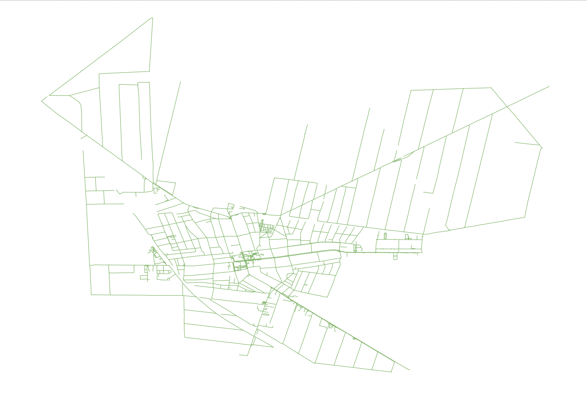
- Bačka Palanka
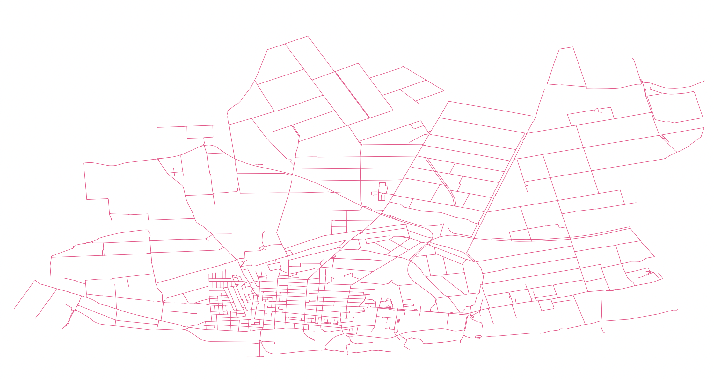
- Ruma
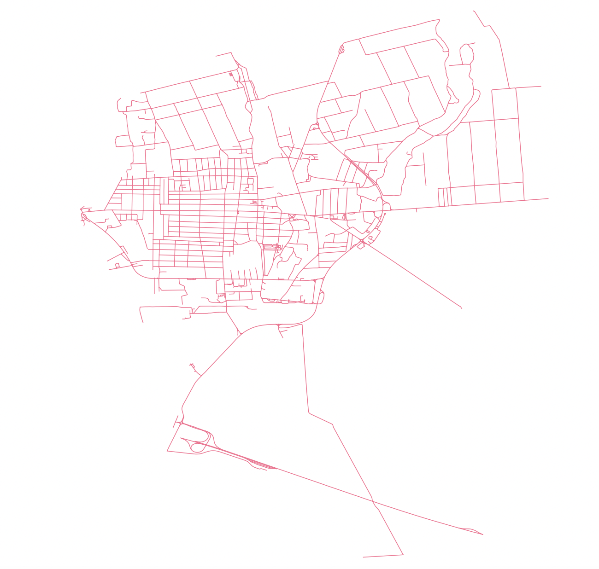
- Paraćin
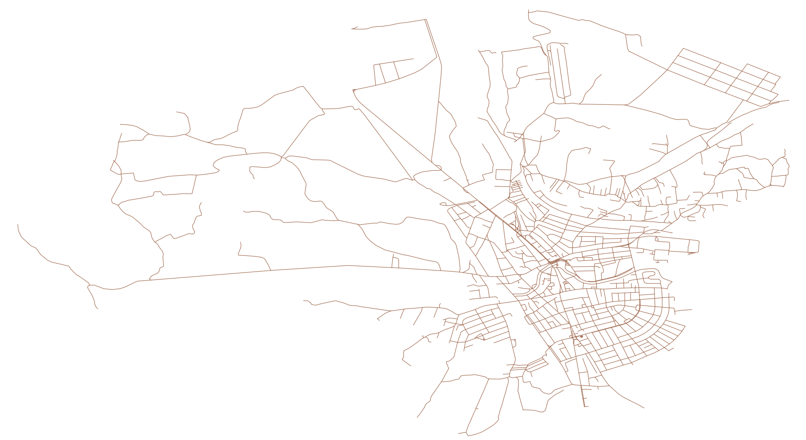
- Aleksinac
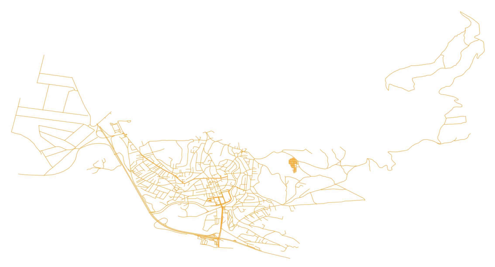
- Smederevska Palanka
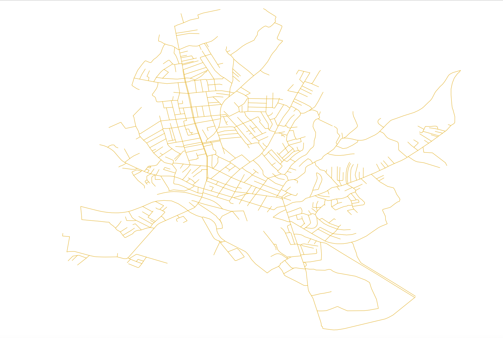
- Inđija

- Aranđelovac
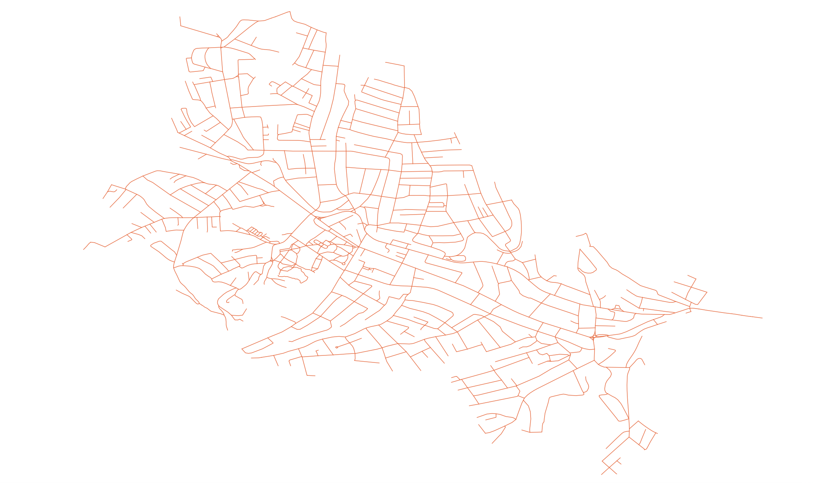
- Gornji Milanovac
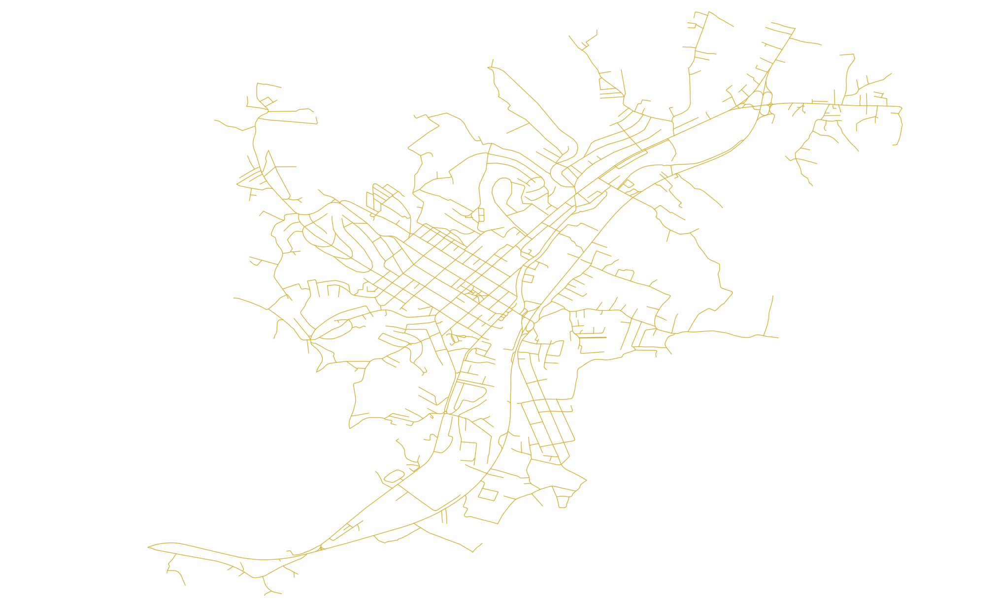
- Bujanovac
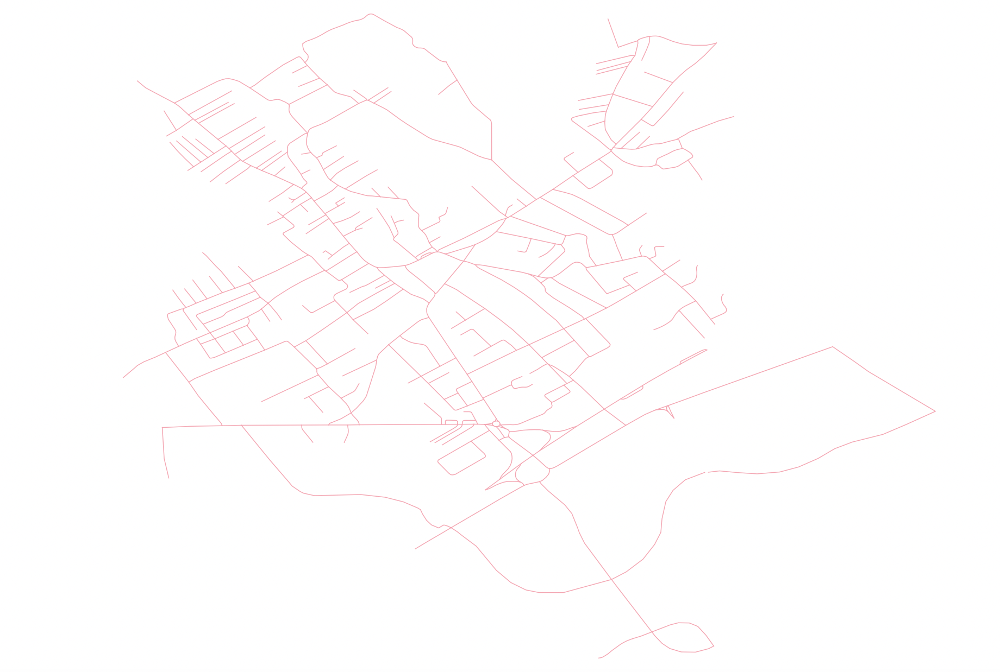
- Prijepolje
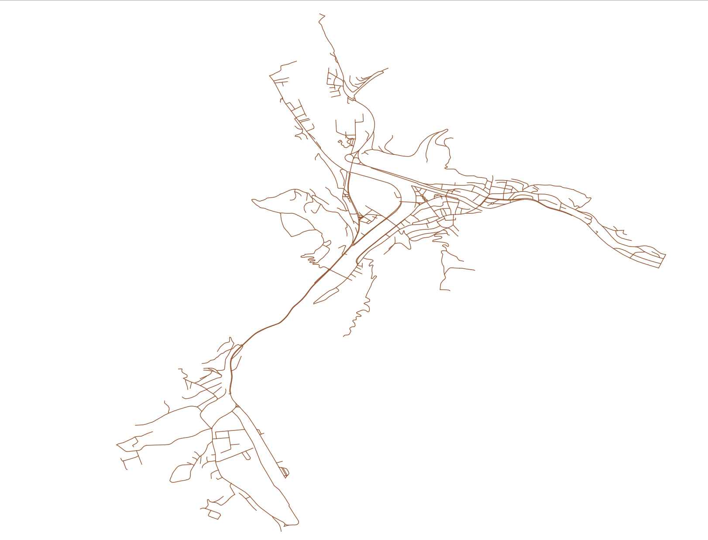
- Preševo
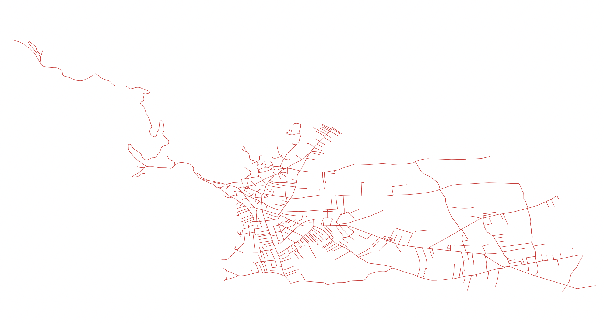
- Priboj

- Bajina Bašta
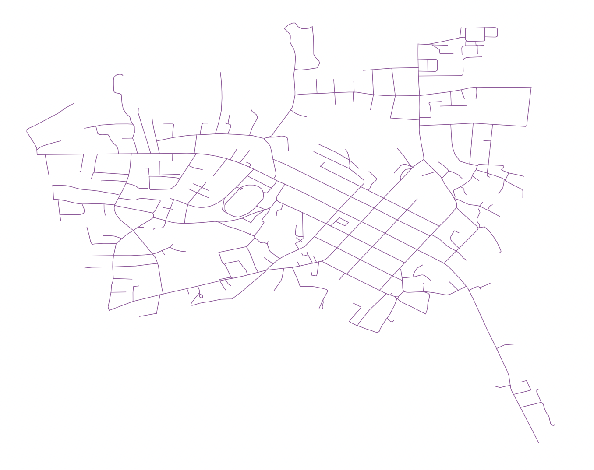
- Priština

- Prizren
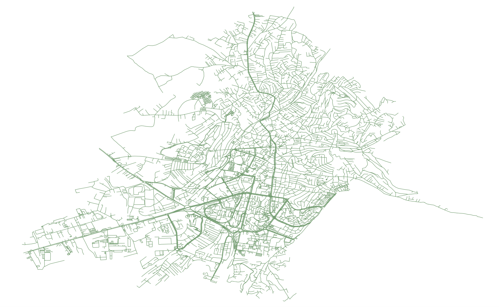
